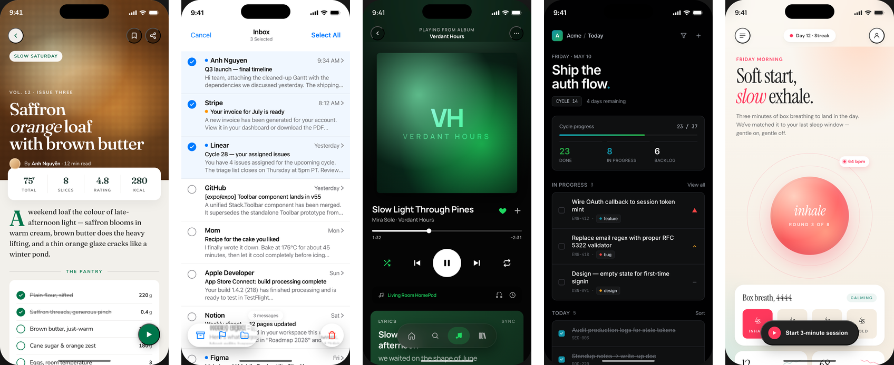
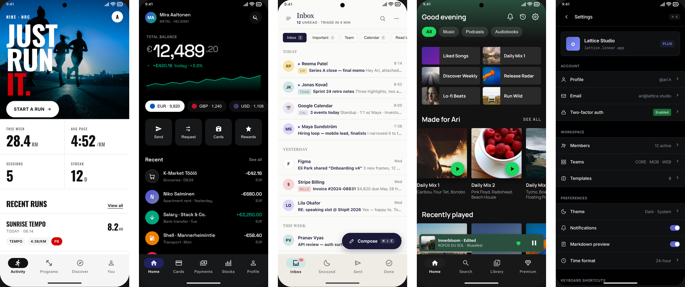
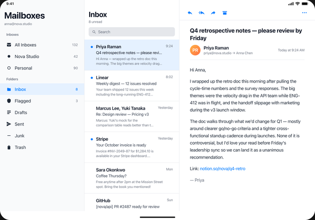
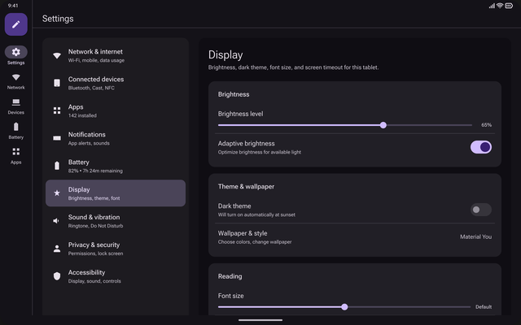
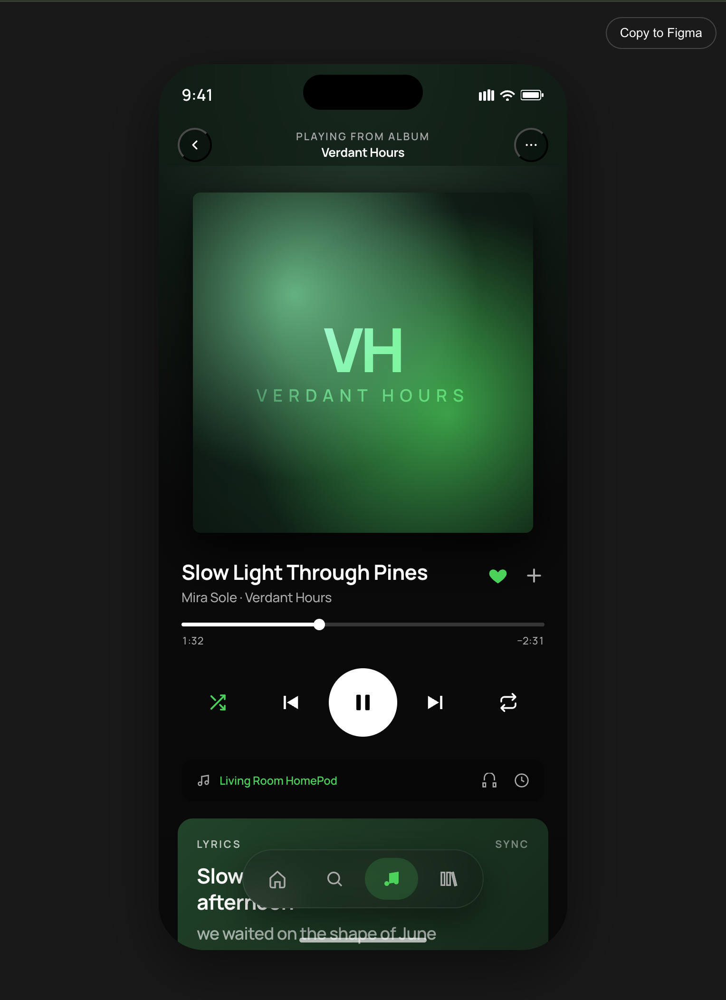

# mobile-design-kit

A Claude Code plugin for designing mobile app screens end-to-end on **iOS (Apple HIG)** and **Android (Material 3)**:

1. **make-mobile-design** — generate production-quality HTML mockups using a reusable component library and platform-aware design tokens.
2. **ios-icon-gen** — export icons (SF Symbols or 275k+ Iconify icons) as Xcode `.imageset` PNG bundles.

## Showcase — iOS

Five iOS screens, five brand aesthetics — generated with `/make-mobile-design`, each grounded in a real brand entry from [VoltAgent/awesome-design-md](https://github.com/VoltAgent/awesome-design-md).



- **Productivity** — [`productivity-today.html`](examples/productivity-today.html) · Linear-style cycle view, near-black canvas, mono accents
- **Music** — [`music-now-playing.html`](examples/music-now-playing.html) · Spotify-style now-playing with glass tab bar
- **Food** — [`food-recipe.html`](examples/food-recipe.html) · Editorial recipe detail with serif display & cream surface
- **Wellness** — [`wellness-breathe.html`](examples/wellness-breathe.html) · Soft-warm breathing timer with serif italic display
- **Mail (Edit Mode)** — [`mail-edit-mode.html`](examples/mail-edit-mode.html) · iOS Mail multi-select with contextual bottom toolbar (component 27)

## Showcase — Android (Material 3)

Native Material 3 / MD3 Expressive — Pixel 8 frame (412×915), Roboto Flex, MD3 type scale, surface roles, and the canonical bottom-nav pill indicator.



- **Home (Photos)** — [`android-home.html`](examples/android-home.html) · Medium top app bar, filter chips, elevated/filled cards, extended FAB, MD3 bottom navigation with pill indicator
- **Settings** — [`android-settings.html`](examples/android-settings.html) · Center-aligned top app bar with back, profile card, grouped lists with MD3 switches
- **Fitness (Today)** — [`android-fitness.html`](examples/android-fitness.html) · Activity-rings card (3 SVG arcs), 2×2 tonal stat-tile grid, workout list with rounded tonal icons, extended FAB
- **Mail (Inbox)** — [`android-mail.html`](examples/android-mail.html) · MD3 search bar with leading menu + trailing avatar, filter chips, two-line mail rows with star toggle, Compose FAB, badge on bottom-nav
- **Music (Now Playing)** — [`android-music.html`](examples/android-music.html) · Center-aligned top app bar with overline, gradient album art, MD3 slider, transport row with prominent play button, up-next list

## Showcase — Tablet

Same skill, same components — bigger canvas. Tablet templates scaffold a landscape device frame (iPad Pro 11" 1194×834 / Pixel Tablet 1280×800 dp) and add layout wrappers (`.split-view`, `.sidebar-ipad`, `.list-detail`, `.nav-rail`) on top of the existing component library. Set `--orientation portrait` to flip.

### iPad (Apple HIG)



- **Mail (Inbox)** — [`ipad-mail-landscape.html`](examples/ipad-mail-landscape.html) · Three-column split view: mailboxes sidebar → inbox list → message detail. Built with [`components/ios/13-tablet-layouts.md`](skills/make-mobile-design/components/ios/13-tablet-layouts.md) wrappers and existing iOS list/nav components.

### Android tablet (Material 3 Expanded)



- **Settings (Display)** — [`android-tablet-settings-landscape.html`](examples/android-tablet-settings-landscape.html) · MD3 expanded-class layout: navigation rail (80dp), top app bar, list-detail panes (360dp list / flex detail) with two-tone `surface-container` surfaces. Built with [`components/android/10-tablet-layouts.md`](skills/make-mobile-design/components/android/10-tablet-layouts.md) wrappers.

Open the HTML files directly to feel the scroll/hover behavior. Each example also includes a floating **Copy to Figma** action — see below.

## Copy to Figma

Every example screen ships with a one-click **Copy to Figma** button in the corner. Click it, switch to Figma, and paste — the screen lands as fully editable vector layers.



- No screenshots, no re-tracing, no exported asset bundles.
- Designers pick up a coded mockup and keep iterating in their native tool.
- Engineers hand off work without annotating static images.
- Design reviews happen on real, editable artifacts.

To regenerate the PNGs (per-screen + showcase strips):

```
cd examples && npm install && node capture.mjs
```

`capture.mjs` writes one PNG per `.html`, then runs `build_strips.py` to recompose the iOS and Android strip images used in the README. The strip script requires Pillow (`python3 -m pip install Pillow`).

## Layout

```
mobile-design-kit/
├── .claude-plugin/
│   └── plugin.json
└── skills/
    ├── make-mobile-design/
    │   ├── SKILL.md             ← orchestrator + platform detection
    │   ├── ios.md               ← iOS-specific design rules (Apple HIG)
    │   ├── android.md           ← Android-specific design rules (Material 3)
    │   ├── components.md        ← index across both platforms
    │   ├── iconify-icons.md
    │   ├── components/
    │   │   ├── ios/             ← iOS component docs (00..13; 13 = tablet layouts)
    │   │   ├── android/         ← Android component docs (01..10; 10 = tablet layouts)
    │   │   └── 11-icons.md      ← cross-platform icon reference
    │   └── scripts/
    │       ├── create_ios_template.py             ← iPhone 14 Pro (430×932)
    │       ├── create_ipad_template.py            ← iPad Pro 11" (1194×834 landscape, --orientation portrait flips)
    │       ├── add_ios_tabbar.py
    │       ├── create_android_template.py          ← Pixel 8 (412×915)
    │       ├── create_android_tablet_template.py   ← Pixel Tablet (1280×800 landscape, --orientation portrait flips)
    │       ├── add_android_navbar.py
    │       └── fetch_design_style.py
    └── ios-icon-gen/
        ├── SKILL.md
        └── scripts/
            ├── iconify_gen.sh
            └── generate_icons.swift
```

## Install from GitHub

### Claude Code (plugin marketplace)

```
/plugin marketplace add trmquang93/mobile-design-kit
/plugin install mobile-design-kit@mobile-design-kit-marketplace
```

### Any agent via [`vercel-labs/skills`](https://github.com/vercel-labs/skills)

Install one or both skills into any supported coding agent (Claude Code, Cursor, Codex, OpenCode, Gemini CLI, Copilot, and 50+ more):

```bash
# List the skills in this repo
npx skills add trmquang93/mobile-design-kit --list

# Install both skills, prompting which agents to target
npx skills add trmquang93/mobile-design-kit --skill '*'

# Or install a single skill to a specific agent
npx skills add trmquang93/mobile-design-kit -s make-mobile-design -a claude-code
npx skills add trmquang93/mobile-design-kit -s ios-icon-gen     -a cursor
```

Skills land in the agent's standard skill directory (e.g. `.claude/skills/`, `.cursor/skills/`, `.agents/skills/`). The bundled scripts under each skill's `scripts/` directory are shipped alongside `SKILL.md` so the workflows work identically across agents.

### Mockup portability

On first scaffold inside your project, the skill copies its shared device-chrome CSS and Copy-to-Figma serializer into a gitignored `.design/` folder at your project root (it's auto-added to your root `.gitignore` if you're in a git repo). Mockups reference those copies via relative paths, so the project tree — mockup + `.design/` — is self-contained and portable to any machine that clones or unzips it. No need for the recipient to have the plugin installed.

To send a single self-contained HTML (email, issue tracker, etc.) without the surrounding project, run the bundler to inline the `.design/` assets into the file:

```bash
python3 skills/make-mobile-design/scripts/bundle_mockup.py path/to/screen.html
# → writes path/to/screen.standalone.html

# Strip the Copy-to-Figma serializer (~12 KB) when the recipient won't use it:
python3 skills/make-mobile-design/scripts/bundle_mockup.py screen.html --no-figma
```

External resources (Google Fonts, Iconify) stay as remote `<link>` tags either way — the recipient just needs internet on first open.

To pick up a chrome update from a newer plugin version, delete `.design/` and run a scaffold again — existing `.design/` files are intentionally never overwritten so a plugin update can't silently change mockups you've already rendered.

## Skills

### `/make-mobile-design [screen-name or description]`
Builds a single self-contained HTML mockup for **iOS** (430×932 iPhone, Apple HIG) or **Android** (412×915 Pixel 8, Material 3). The skill detects the platform from your wording (mentions of "Android", "Material", "Pixel" → Android; otherwise defaults to iOS) and confirms before scaffolding when the signal is weak. Each platform pulls from its own component library and design-rules file (`ios.md` / `android.md`). Auto-creates a `design-system.html` for the project on first run.

### `/ios-icon-gen [search <query> | <icon-source> <asset-name> [options]]`
Search and export icons:

```bash
# Search Iconify
ios-icon-gen search "receipt" --prefix mdi

# Generate Iconify imageset
ios-icon-gen mdi:receipt-text-outline editTool_expenseReport --color 8E8E93 --output ./Assets.xcassets/icons

# Generate SF Symbol imageset
swift scripts/generate_icons.swift doc.text.below.ecg myIcon --weight regular
```

## Typical workflow

1. `/make-mobile-design dashboard` — produces `dashboard.html` referencing Iconify icons by URL.
2. Approve the mockup in the browser.
3. `/ios-icon-gen mdi:home-outline tabHome --output ./Assets.xcassets/Tabs` — bake every chosen icon into Xcode assets.
