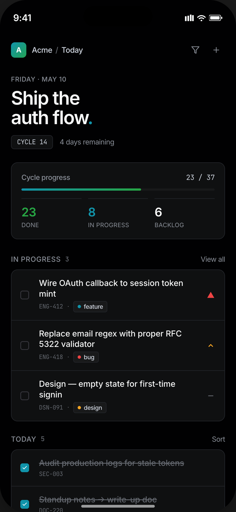
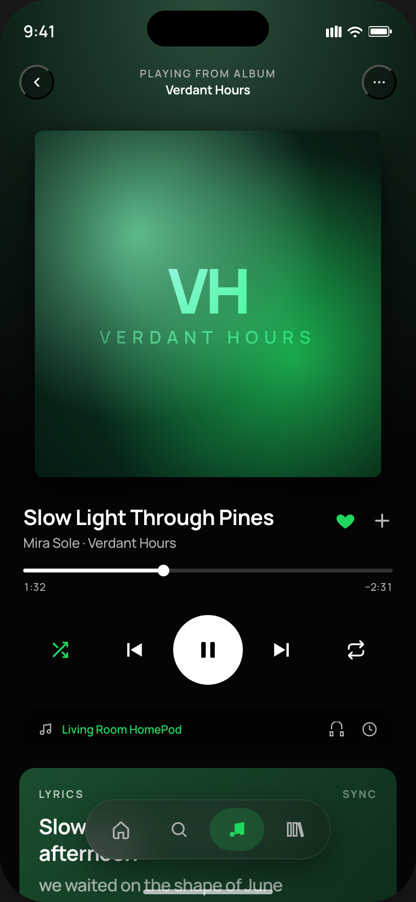
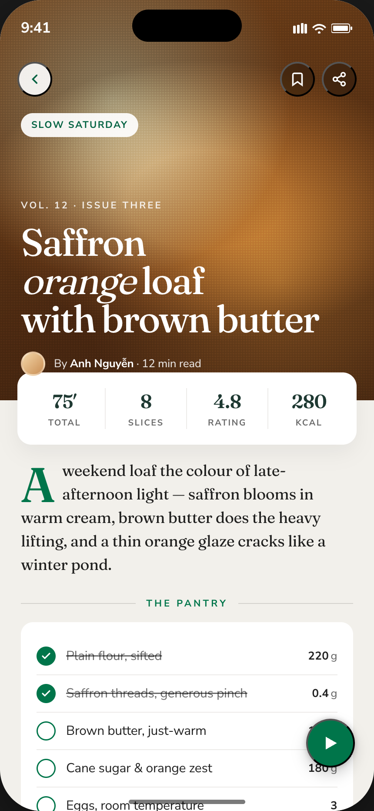
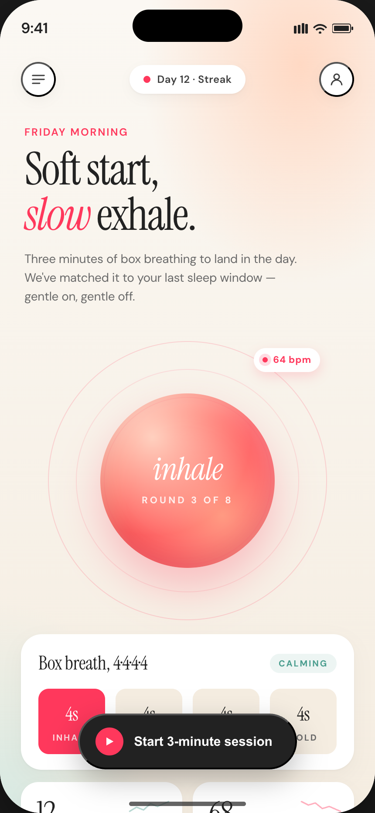

# mobile-design-kit

A Claude Code plugin for designing mobile app screens end-to-end:

1. **make-mobile-design** — generate production-quality HTML mockups using a reusable component library and design tokens.
2. **ios-icon-gen** — export icons (SF Symbols or 275k+ Iconify icons) as Xcode `.imageset` PNG bundles.

## Showcase

Four screens, four brand aesthetics — generated with `/make-mobile-design`, each grounded in a real brand entry from [VoltAgent/awesome-design-md](https://github.com/VoltAgent/awesome-design-md).

| Productivity | Music | Food | Wellness |
| :---: | :---: | :---: | :---: |
| [](examples/productivity-today.html) | [](examples/music-now-playing.html) | [](examples/food-recipe.html) | [](examples/wellness-breathe.html) |
| Linear-style cycle view, near-black canvas, mono accents | Spotify-style now-playing with glass tab bar | Editorial recipe detail with serif display & cream surface | Soft-warm breathing timer with serif italic display |

Open the HTML files directly to feel the scroll/hover behavior. To regenerate the PNGs:

```
cd examples && npm install && node capture.mjs
```

## Layout

```
mobile-design-kit/
├── .claude-plugin/
│   └── plugin.json
└── skills/
    ├── make-mobile-design/
    │   ├── SKILL.md
    │   ├── components.md
    │   ├── iconify-icons.md
    │   └── components/
    └── ios-icon-gen/
        ├── SKILL.md
        └── scripts/
            ├── iconify_gen.sh
            └── generate_icons.swift
```

## Install from GitHub

```
/plugin marketplace add trmquang93/mobile-design-kit
/plugin install mobile-design-kit@mobile-design-kit-marketplace
```

## Skills

### `/make-mobile-design [screen-name or description]`
Builds a single self-contained HTML mockup (max-width 430px) with status bar, nav, and components from the bundled library. Auto-creates a `design-system.html` for the project on first run.

### `/ios-icon-gen [search <query> | <icon-source> <asset-name> [options]]`
Search and export icons:

```bash
# Search Iconify
ios-icon-gen search "receipt" --prefix mdi

# Generate Iconify imageset
ios-icon-gen mdi:receipt-text-outline editTool_expenseReport --color 8E8E93 --output ./Assets.xcassets/icons

# Generate SF Symbol imageset
swift scripts/generate_icons.swift doc.text.below.ecg myIcon --weight regular
```

## Typical workflow

1. `/make-mobile-design dashboard` — produces `dashboard.html` referencing Iconify icons by URL.
2. Approve the mockup in the browser.
3. `/ios-icon-gen mdi:home-outline tabHome --output ./Assets.xcassets/Tabs` — bake every chosen icon into Xcode assets.
